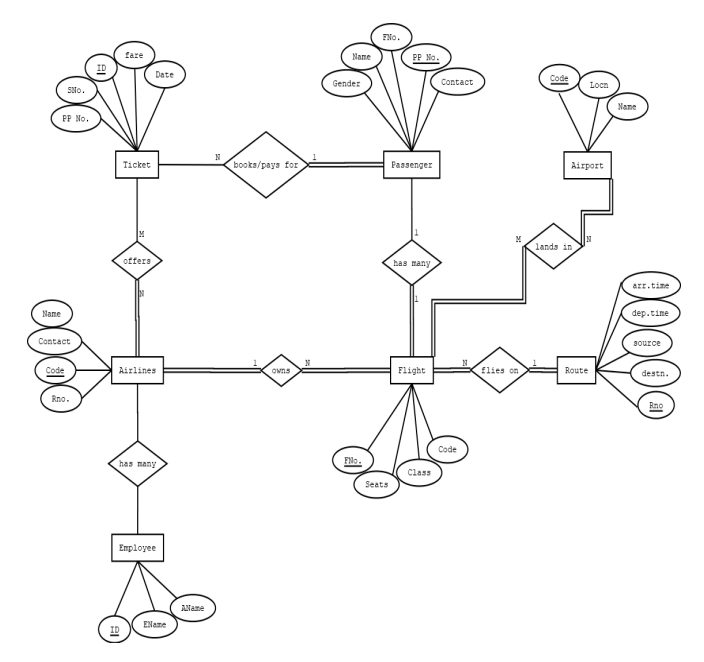
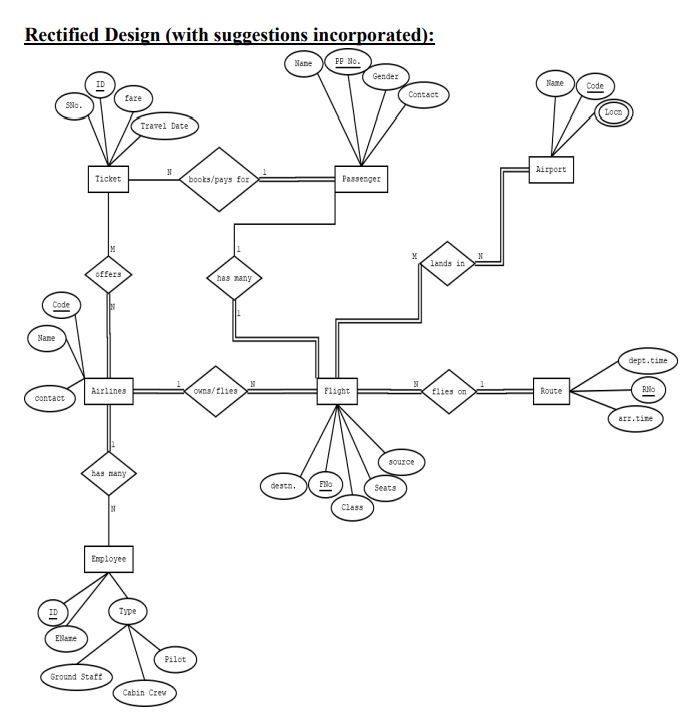
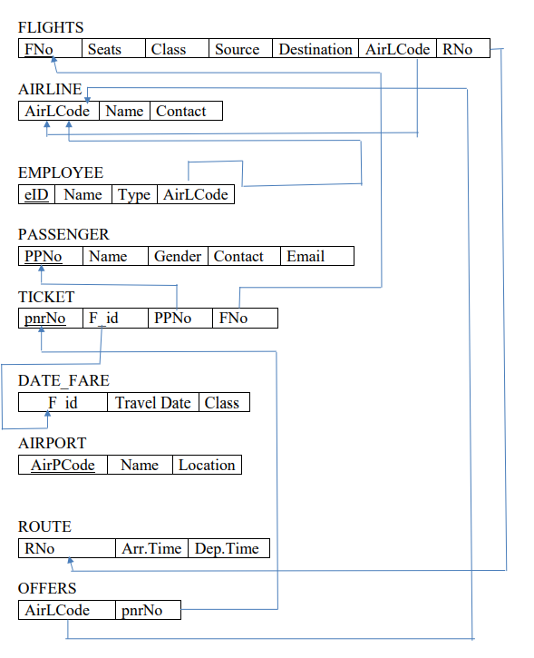

# Airline Reservation System

This project is an implementation of a simple airline reservation system using Node.js and MongoDB as part of coursework in the Database Management Systems. 

The initial ER diagram for the system is as follows:

After implementing suggested modifications, our final ER diagram is as follows:

##### Justification for changes:
The following are the reasons why the rectified design is better than the initial 
design:
- In the initial design, the foreign – key constraint is violated.
- The attributes are related to the wrong entities.
- Some more attributes are added to the entities in the rectified design.
- The participation constraints between the entities are corrected

The relational schema diagram for our system can observed in the following image.

